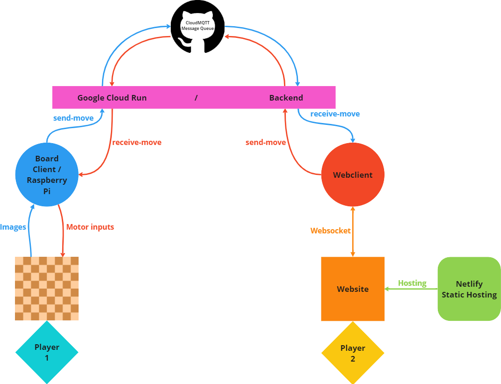
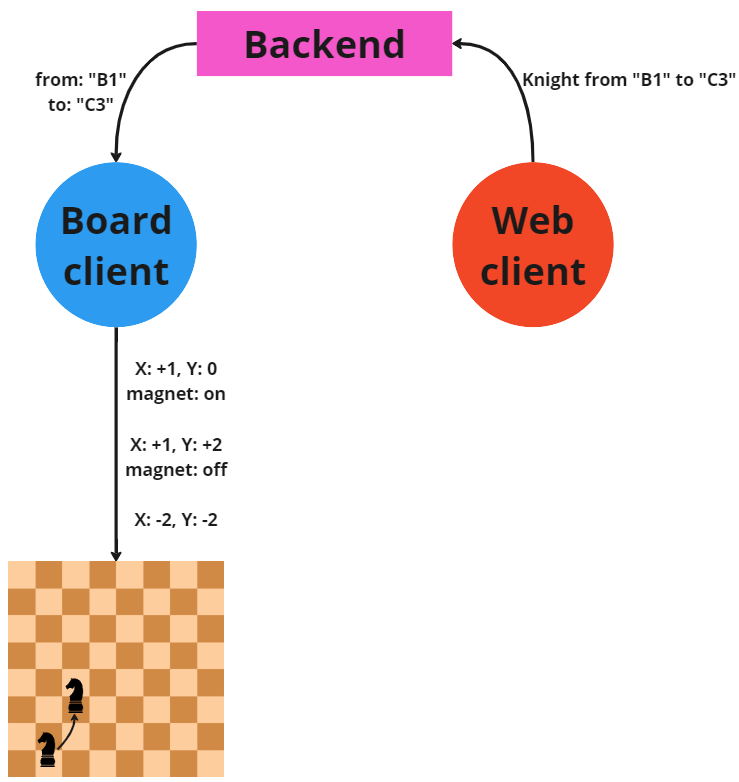

# Chess:E Board Client
Chess:E is an internet-enabled, physical chess robot that allows remote players to connect and play chess together in a tangible, analog experience. The robot is equipped with an electromagnet that holds chess pieces from beneath the board and two  stepper motors that move the electromagnet across each of the two axes. The board client, which runs on a Raspberry Pi 400, serves as a bridge between the robot's motors and the backend server of our website, [https://pawn-hub.de](https://pawn-hub.de).

This documentation describes the board client and how it enables players to play chess remotely. 

## Setup
Clone the repository

	$ git clone https://github.com/PawnHubChess/client-board

Install dependencies

	$ pip install -r requirements.txt

## Play against AI
- Run `main/client.py` 
- Answer with `yes`, when asked whether you want to play against the AI
- Choose a difficulty level (higher difficulties results in longer response times)
	- Answer with `1`, for easy difficulty
	- Answer with `2`, for medium difficulty
	- Answer with `3`, for hard difficulty
- Answer with `yes` or `no`, whether you want board visualisation in the console

Go to [https://pawn-hub.de/play](https://pawn-hub.de/play) and enter your connection code and ID **OR** click on the connection link provided in the console.
**Disclaimer:** Trying to connect to the game will usually fail on the first try, but succeed after retrying.

You can now play chess against the AI. The program will end when one of you wins or when you leave the game.

## Play against opponent on robot
- Run `main/client.py` 
- Answer with `no`, when asked whether you want to play against the AI
- Answer with `yes` or `no`, whether you want board visualisation in the console

Go to [https://pawn-hub.de/play](https://pawn-hub.de/play) and enter your connection code and ID **OR** click on the connection link provided in the console.
**Disclaimer:** Trying to connect to the game will usually fail on the first try, but succeed after retrying.

You can now play chess against an opponent on the chess robot. Every move you make on the website will be mirrored on the physical board.

## Architecture

The Chess:E project is composed of multiple components that work together to enable remote gameplay. The focus of this documentation is the architecture of the board client.

### Client
The `client` module is the main program of the board client and serves as the entry point for all other modules. It connects to the backend server via websockets and generates a randomized connection code and link for each game. It sends and receives JSON string commands to and from the backend, accepts or declines attendee requests from website players, and sends and receives chess moves. The program exits when the opponent disconnects from the game.

### Chess AI
The `chess_ai` module hosts every function which is responsible for enabling a game against the AI. It assigns a score to the local chess board based on the values of the pieces, iterates over every square, retrieves the piece on the square, and adds or subtracts the piece’s value to the score depending on the piece color.

It searches through the game tree to determine the best move for the current player. The `depth` parameter determines how many moves ahead to consider, the `alpha` and `beta` parameter are used to prune the search tree. It generates all possible moves and recursively calls `minimax` on each possible one while updating `alpha` and `beta`.

It first checks whether the `player_move` is legal and pushes it onto the board. Then, it uses the `minimax` function to find the best move and adds the one with the highest score to the board.

### Motors
The `motor` and `motor_move` modules host classes which are responsible for the general movement of the robot's motors. The `motor` module sets up the connection between Raspberry Pi and motors by configuring their pins. The `motor_move` inherits from the `motor` and hosts all functions that make the motors move with the parameters given on call.

### Piece Coordinates
The `piece_coordinates` module hosts the `ChessPiece` class which is responsible for the translation of the different move coordinate formats across all used applications. 
- Converts backend suitable coordinates into motor suitable coordinates
	- Converts JSON string dictionaries into integers
	- Calculates the numerical difference in X- and Y-coordinate for each move and returns it to the motors
- Converts backend suitable coordinates into AI suitable coordinates and vice versa
	- Converts JSON string dictionaries into algebraic notation and vice versa

Additionally it hosts a `fen_visualiser` function which prints the current board state, in the form of a 2D array, into the console.

### Units
Saves all required units, which are used for motor movements.

### Pins
Saves the pins regulation for the connection of Raspberry Pi and motors.

## Requestflow

The board client connects to the backend server via websockets and hosts a game of chess. Opponents who join the game can make moves on their digital board, which are transmitted to the backend server. The backend server forwards this move data to the board client, which interprets the information. The board client translates this move data into motor inputs that position the electromagnet from its origin location to the starting position of the move, activating the electromagnet. Then, the robot moves the chess piece to its destination and deactivates the electromagnet. Finally, the robot returns the electromagnet to its origin location, completing the move.
